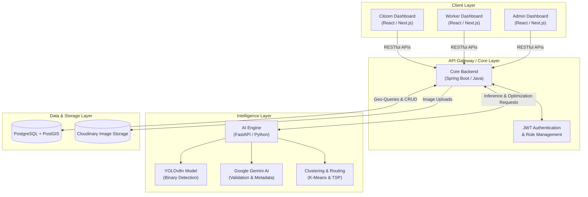
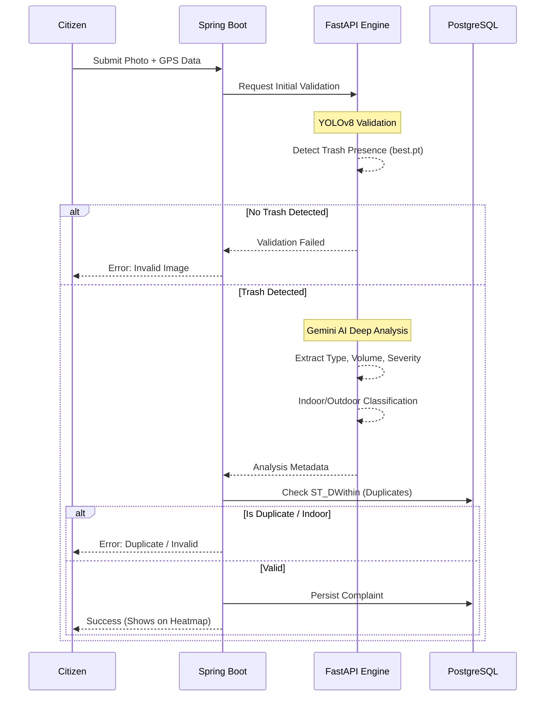
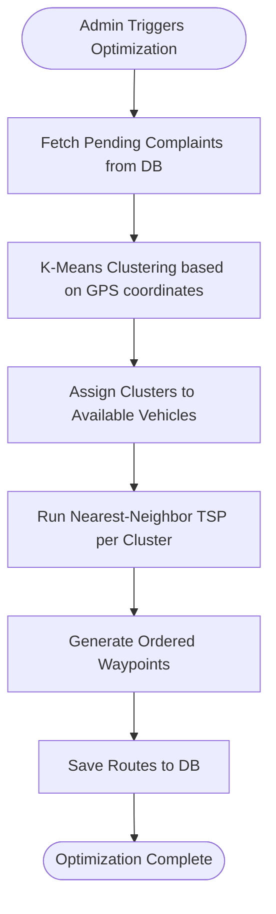
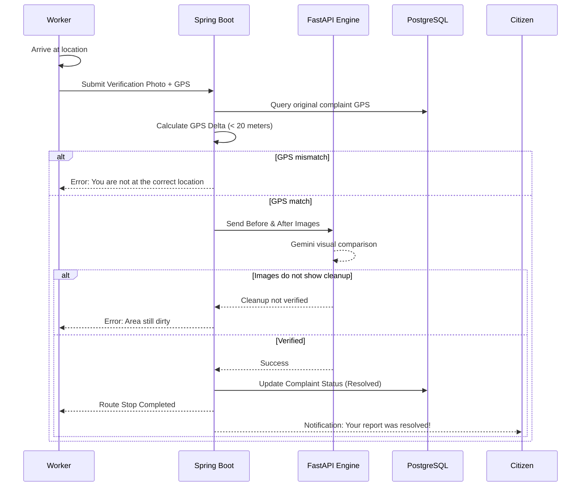

# Chokho AI - Intelligent Waste Management & Route Optimization Platform

Chokho is an enterprise-grade, intelligent waste management and monitoring system built for high-traffic urban and suburban areas. The system addresses the critical problem of unmanaged public waste, providing a complete, data-driven accountability loop from citizen complaint to verified cleanup. 

By leveraging modern microservices, artificial intelligence, and geospatial algorithms, Chokho ensures optimized municipal worker dispatches and verifiable civic maintenance.

---

## The Problem

Public waste accumulation on roads in Dehradun and surrounding high-footfall areas (like Haridwar and Rishikesh) is a persistent civic challenge. The core issues are:
1. **Lack of Structured Reporting**: There is no unified mechanism for citizens to report waste reliably.
2. **Inefficient Dispatching**: Municipal workers are dispatched without optimized routing or severity-based prioritization.
3. **No Accountability**: There is no verifiable record of whether reported waste was actually cleaned.

## The Solution

Chokho resolves these issues by dividing the process into two intelligent phases:

1. **Phase 1 — Citizen Reporting and AI Validation**  
   Citizens photograph waste on public roads. The system validates the complaint through a two-stage AI pipeline: YOLOv8n performs high-speed binary trash detection, while Google Gemini extracts metadata (trash type, volume, severity) and filters out indoor images. This prevents fake or duplicate complaints from cluttering the system.

2. **Phase 2 — Route Optimization and Verified Cleanup**  
   The system clusters pending complaints using K-Means and determines the optimal visit order using a nearest-neighbor TSP algorithm. Municipal workers receive optimized routes and must submit a GPS-verified photo upon completion. Gemini AI visually compares the before-and-after images to establish a mathematically and visually proven accountability loop.

---

## High-Level Architecture

The platform operates on a microservices-inspired architecture, ensuring strict separation of concerns, scalability, and optimal performance for both I/O bound and CPU/GPU bound tasks.

### Core Components
1. **Frontend Application**: Built with Next.js 16, React 19, TypeScript, and Tailwind CSS.
2. **Core Backend**: Built with Spring Boot 4 and Java 23. Handles all business logic, data persistence, and user state.
3. **AI Engine**: Built with FastAPI and Python. Specializes in heavy computations, computer vision, and spatial algorithms.
4. **Data Layer**: PostgreSQL extended with PostGIS for advanced geospatial queries. Cloudinary handles robust image hosting.

---

## System Workflows

### 1. Citizen Reporting and AI Validation
When a citizen reports a waste issue, the system employs a two-stage AI pipeline to filter out noise, fake reports, and duplicates.

**Anti-Fake Mechanisms:**
- **Indoor Rejection**: Gemini AI classifies whether a photo was taken indoors to prevent false reporting from inside private properties.
- **Duplicate Prevention**: PostGIS spatial queries check against existing complaints within a specific radius.

---

### 2. Route Optimization and Task Assignment
To optimize municipal efforts, pending verified complaints are grouped and ordered for the municipal fleet.

- **K-Means Clustering**: Groups tasks geographically so each vehicle handles a specific sector.
- **Nearest-Neighbor TSP**: Calculates the shortest path traversing all assigned complaints for a given vehicle.

---

### 3. Verified Cleanup & Accountability
To close the loop, municipal workers must mathematically and visually prove the completion of their tasks.

---

## Technology Stack Summary

- **Core Backend**: Java 23, Spring Boot 4, Spring Security, Spring Data JPA, Hibernate, JWT.
- **AI Microservice**: Python 3.10+, FastAPI, Pydantic, Uvicorn, Scikit-learn.
- **AI Models**: YOLOv8n (Ultralytics), Google Gemini.
- **Frontend App**: Next.js 16, React 19, TypeScript, Tailwind CSS, Leaflet.js, Radix UI.
- **Datastore & Storage**: PostgreSQL, PostGIS, Cloudinary.
